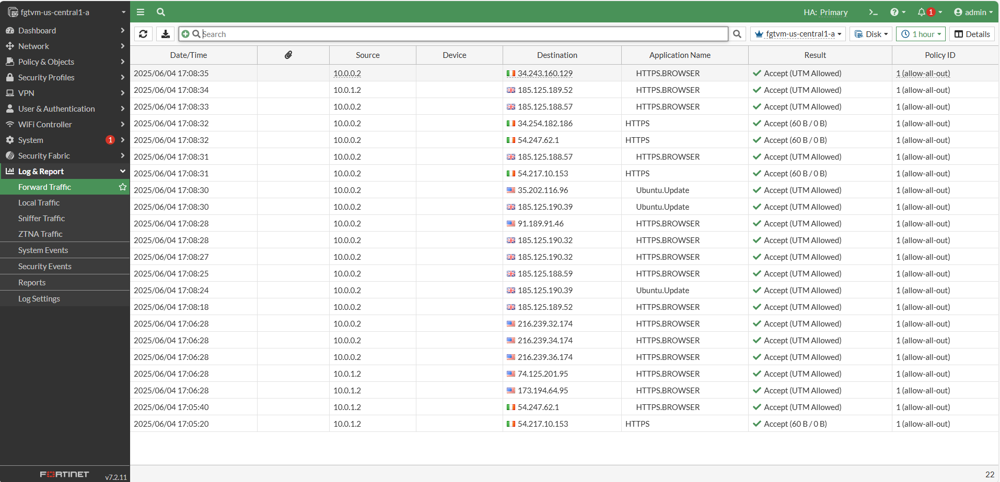
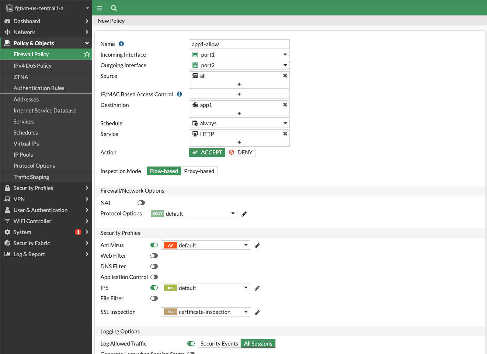
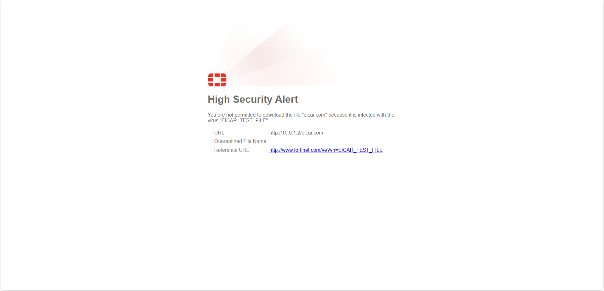
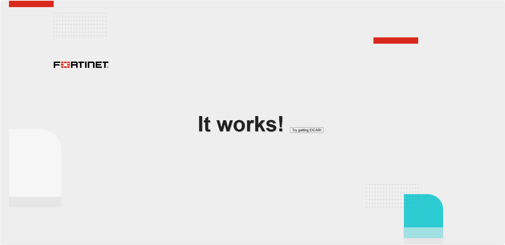

# 🔒 FortiGate in Google Cloud – Traffic Inspection Lab

This project demonstrates how to deploy and configure a **FortiGate Next-Generation Firewall (NGFW)** in **Google Cloud Platform (GCP)** to inspect and secure **inbound, outbound, and east-west** traffic.

> 💡 Built using Qwiklabs environment and Fortinet best practices.

---

## 📌 Project Goals

- Redirect inbound traffic to an internal web app (`frontend-vm`)
- Secure outbound traffic from VMs to the internet
- Inspect east-west traffic between `frontend-vm` and `backend-vm` using dynamic tagging
- Apply IPS, Antivirus, Application Control & SSL Inspection policies
- View traffic logs and threat detection events via FortiGate GUI

---

## 🧠 Architecture Summary

```text
Internet → ELB → FortiGate (port1) → VIP (ELB_IP → 10.0.0.2) → frontend-vm (port2) ↔ backend-vm (10.0.1.2) via FortiGate (port2)
```


All traffic passes through FortiGate before reaching internal VMs or the internet.

---

## 📁 Project Structure

| Folder / File | Description |
|---------------|-------------|
| `architecture/flow-diagram.md` | Visual and logical flow of traffic (Inbound, Outbound, East-West) |
| `documentation/task1-routing.md` | Static route config to workload VPCs |
| `documentation/task2-outbound-policy.md` | Outbound policy setup and test |
| `documentation/task3-inbound-policy.md` | VIP + Inbound firewall rule setup |
| `documentation/task4-east-west-policy.md` | Internal communication policies and threat inspection |
| `documentation/logs-analysis.md` | Screenshots and summary of logged events |
| `screenshots/` | Visual evidence of all configurations and results |

---

## 📸 Key Screenshots

| Category | Preview |
|---------|---------|
| Outbound Logs |  |
| Inbound Policy |  |
| EICAR Alert |  |
| "It works!" |  |

---

## ✅ Lab Tools Used

- FortiGate NGFW v7.2.11 (GUI + Policy Engine)
- GCP: VPCs, Load Balancer, Compute Engine
- Tags and Dynamic Addressing (Fabric Connector)
- Logging: Forward Traffic with UTM inspection

---

## 🧪 Threat Detection Example

The following test was used to validate antivirus functionality:

- Attempted to download `EICAR` test file from `frontend-vm`
- FortiGate successfully intercepted and blocked the file

---

## 📬 Contact

Feel free to reach out if you'd like a guided walkthrough or need a similar architecture deployed in your cloud infrastructure.

---

> 🔐 This project reflects real-world secure cloud architecture practices and hands-on expertise with Fortinet in GCP.
