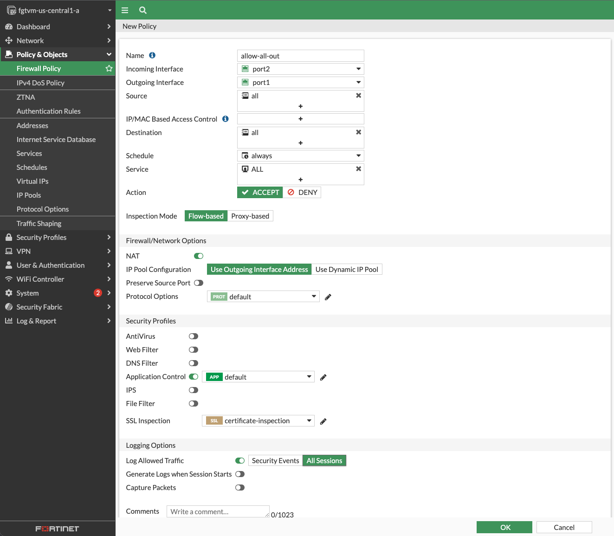

# 🌐 Task 2: Outbound Traffic Policy

This task enables internet access for internal VMs (`frontend-vm`, `backend-vm`) by configuring a **firewall policy** in FortiGate to allow outbound traffic through `port1`.

---

## 🎯 Objective

Allow internal virtual machines to access the Internet **securely** via FortiGate, while applying **security inspection** and **full session logging**.

---

## ⚙️ Configuration Steps

1. Access the **primary FortiGate GUI**
2. Navigate to:  
   `Policy & Objects > Firewall Policy`
3. Click **Create New**
4. Enter the following:
   - **Name:** `allow-outbound-all`
   - **Incoming Interface:** `port2`
   - **Outgoing Interface:** `port1`
   - **Source:** `all`
   - **Destination:** `all`
   - **Service:** `all`
   - **NAT:** ✅ Enabled
   - **Security Profiles:**
     - **Application Control:** Enabled
     - **SSL Inspection:** `certificate-inspection`
   - **Log Allowed Traffic:** `All Sessions`
5. Click **OK** to save the policy

---

## 🧠 Why This Is Important

Cloud VMs by default cannot reach the Internet unless explicitly routed and permitted. This policy:

- Enables critical functions like package updates, time sync, telemetry
- Ensures FortiGate is the **egress inspection point**
- Applies **deep visibility** via application control
- Inspects TLS handshake metadata via **SSL inspection**
- Logs all connections for forensic visibility

---

## 🧪 Test Performed

After enabling this policy:

- `frontend-vm` and `backend-vm` were restarted
- They attempted to connect to Ubuntu update servers
- Traffic appeared in:  
  `Log & Report > Forward Traffic`  
  with source IPs `10.0.0.2` and `10.0.1.2`

✅ This confirms that **outbound connectivity works through FortiGate** and is being inspected.

