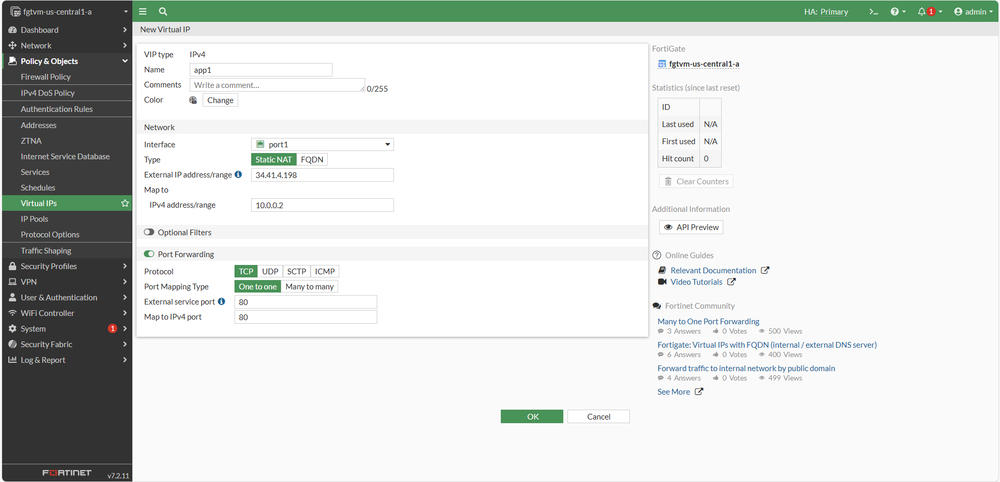
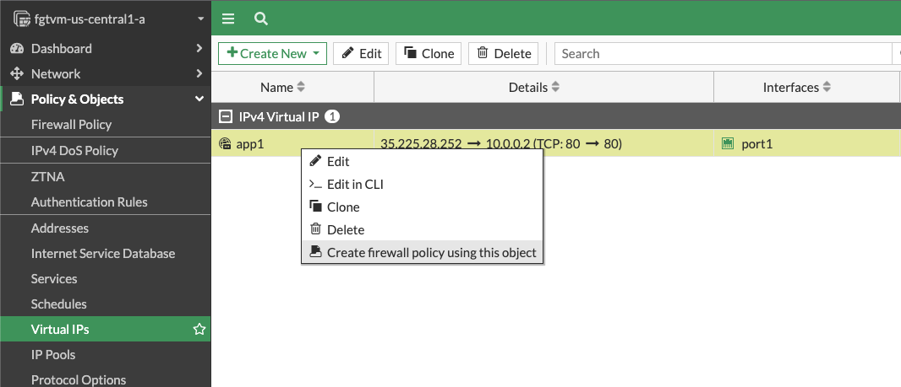
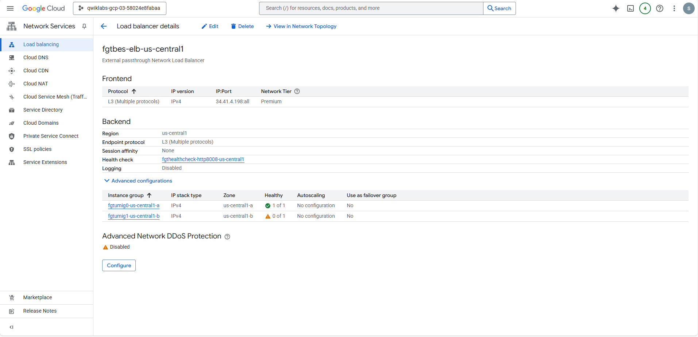
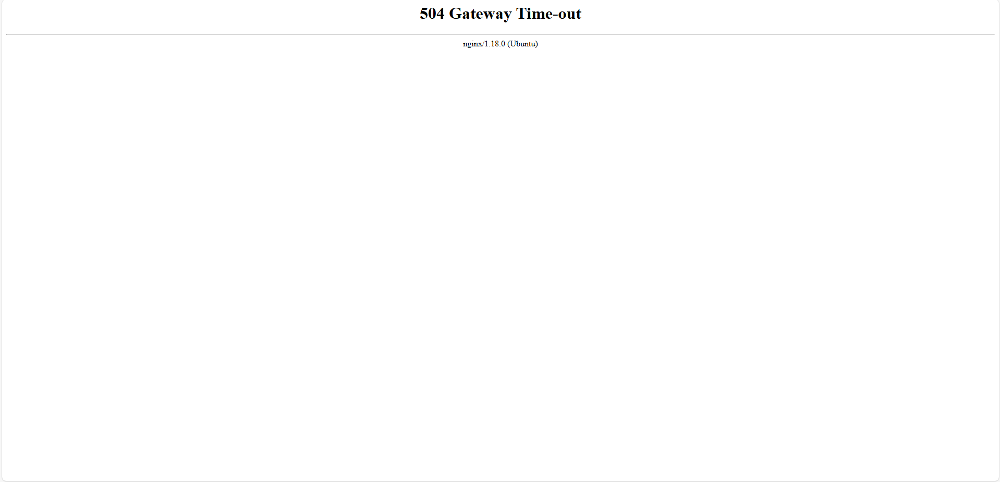

# 🔐 Task 3: Inbound Traffic via Virtual IP (VIP)

In this task, we configured FortiGate to accept **HTTP traffic from the internet** and redirect it to the internal `frontend-vm` using a **Virtual IP (VIP)** and a firewall policy.

---

## 🎯 Objective

Allow users from the public internet to access a web application hosted on `frontend-vm`, while ensuring traffic is **inspected and controlled** by FortiGate.

---

## ⚙️ Configuration Steps

### 1. Create Virtual IP

### 2. Verify VIP and Create Policy

### 3. Configure Firewall Policy for Inbound Access

### 1. Create Virtual IP (VIP)
- Navigate to: `Policy & Objects > Virtual IPs`
- Click **Create New**
- Enter:
  - **Name:** `vip-http-to-frontend`
  - **Interface:** `port1`
  - **External IP Address:** `<ELB_PUBLIC_IP>`
  - **Mapped IP Address:** `10.0.0.2`
  - **Enable Port Forwarding**
  - **External Service Port:** `80`
  - **Mapped Port:** `80`
- Click **OK**

### 2. Create Firewall Policy for Inbound Traffic
- Right-click the VIP → `Create firewall policy using this object`
- Complete the following:
  - **Name:** `allow-inbound-http`
  - **Incoming Interface:** `port1`
  - **Outgoing Interface:** `port2`
  - **Source:** `all`
  - **Destination:** `vip-http-to-frontend`
  - **Service:** `HTTP`
  - **NAT:** ❌ Disabled
  - **Security Profiles:** 
    - **IPS:** Enabled
    - **SSL Inspection:** `certificate-inspection`
  - **Log Allowed Traffic:** `All Sessions`
- Click **OK**

---

## 📌 Why VIP + Policy Are Necessary

- **Frontend VMs do not have public IPs**
- ELB forwards requests to FortiGate (`port1`)
- FortiGate uses **VIP to NAT** the request to internal IP `10.0.0.2`
- The firewall policy **permits and inspects** that traffic

---

## 🧪 Test Performed

- Opened browser to:  
  `http://<ELB_PUBLIC_IP>/`
- Result:  
  ✔️ **"It works!"** response from frontend server

📥 This confirms VIP NAT and policy are functioning correctly.

If backend is unreachable (as in this task), a `504 Gateway Time-out` is expected.

